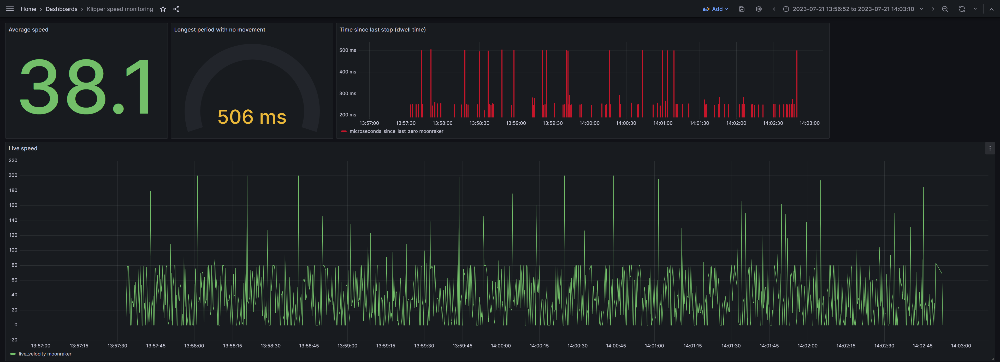

# Klipper speed monitoring
3D printer speed monitoring dashboard for Klipper.



### Requirements
- Klipper w/ Moonraker (already installed if you're using Fluidd or Mainsail); use [KIAUH](https://github.com/th33xitus/kiauh) to install it
- InfluxDB 2 (the metrics database)
  - An auth token you generate
- Grafana (tested on Grafana 10, but should work with older ones just fine)
- Python

### Usage
This can run on any computer with Python on it, and it'll interface with both your printer and your metrics db (InfluxDB)
- Copy `.env.template` to `.env`, edit the file
```bash
# Example config
export INFLUXDB_URL="http://influxdb.local:8086"  # url to your InfluxDB instance
export INFLUXDB_TOKEN="bunch of numbers and characters"  # token you generate
export INFLUXDB_BUCKET="moonraker"
export INFLUXDB_ORG="home"
export BASE_MOONRAKER_HOST="klipper.local:7125"  # IP of your RaspberryPi (or anything else) running Klipper
```
- Install python dependencies:
```bash
$ pip install -r requirements.txt
```
- Run the script
```bash
$ source .env  # unrelated to Python virtualenv! You can use venv just fine
$ python ws_client.py
> Subscribed successfully
```
- Import `dashboard.json` to your grafana instance


### **FAQ**
- **Q:** Fluidd already supports speed diagnostics, why would I need this?
- **A:** Fluidd metrics live in your browser tab. Soon as you turn it off, they're lost. This allows you to revisit previous prints to compare and contrast any improvements you're making.

### **TODO/Help wanted**
- Grafana Live setup for the `Live speed` panel; MQTT broker sending data to both influx and grafana
  - Should load historical data first, then start loading live data on top, if possible
- Adapters for writing to metrics DBs other than Influx